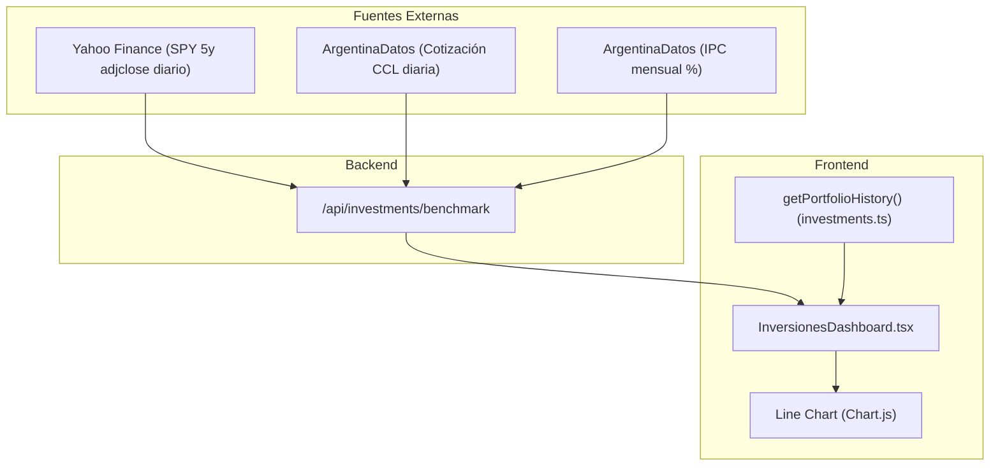

# Rendimiento Acumulado de Inversiones (% vs. Benchmarks)

Este documento detalla la arquitectura, fórmulas matemáticas, obtención de datos y representación gráfica del módulo de **Rendimiento Acumulado (% vs. Benchmarks)** del Dashboard de Inversiones.

---

## 1. Arquitectura General y Flujo de Datos

El gráfico compara la evolución porcentual del portafolio del usuario contra tres referencias externas de mercado:
- **S&P 500 (SPY)** (Renta variable internacional con dividendos reinvertidos - Total Return)
- **Dólar CCL** (Tipo de cambio financiero libre Contado con Liquidación, referencia de CEDEARs y Cripto)
- **Inflación IPC** (Índice de Precios al Consumidor oficial de Argentina)

---

## 2. Fuentes de Datos y Endpoint Backend

Los datos de los benchmarks se obtienen mediante la API interna:
- **Ruta**: [`src/app/api/investments/benchmark/route.ts`](../src/app/api/investments/benchmark/route.ts)
- **Mecanismo**: `Promise.allSettled` para consultar concurrentemente las tres fuentes con revalidación y caché HTTP de 1 hora (`revalidate: 3600`, `s-maxage=3600, stale-while-revalidate=7200`).

| Benchmark | Proveedor / URL | Estructura de Datos |
| :--- | :--- | :--- |
| **S&P 500** | Yahoo Finance (`query1.finance.yahoo.com/v8/finance/chart/SPY?interval=1d&range=5y`) - campo `adjclose` | `{ timestamp: number, price: number }[]` |
| **Dólar CCL** | ArgentinaDatos (`api.argentinadatos.com/v1/cotizaciones/dolares/contadoconliqui`) | `{ date: string ("YYYY-MM-DD"), rate: number }[]` |
| **Inflación IPC** | ArgentinaDatos (`api.argentinadatos.com/v1/finanzas/indices/inflacion`) | `{ date: string ("YYYY-MM-DD"), rate: number }[]` |

---

## 3. Base Temporal y Grilla Homogénea ($t_0$)

Para garantizar una comparación homogénea y continua:
1. **Línea de tiempo**: El eje X se construye a partir de una grilla uniforme que incluye:
   - Todas las fechas de transacciones reales del usuario.
   - El último día de cada mes intermedio entre $t_0$ y hoy.
   - La fecha actual (`today`).
2. **Punto cero ($t_0$)**: Corresponde a la fecha de la **primera transacción registrada** en la cartera (`history[0].date`).
3. **Normalización**: En $t_0$, todas las métricas comienzan en **0%**. Los puntos sucesivos expresan la variación porcentual acumulada desde dicho instante.

---

## 4. Algoritmos y Fórmulas Matemáticas

Todo el cálculo de las curvas se ejecuta de manera reactiva dentro del `useMemo` de `relativePerformanceData` en [`src/components/inversiones/InversionesDashboard.tsx`](../src/components/inversiones/InversionesDashboard.tsx).

### 4.1. Rendimiento del Portafolio: TWR y Ledger de Efectivo

Calculado en [`src/lib/utils/investments.ts`](../src/lib/utils/investments.ts):

1. **Gestión Interna de Liquidez (Cash Ledger)**:
   - **Venta**: El producido neto incrementa la caja interna sin salir de la cuenta bancaria:
     $$\text{cashBalance} += (\text{cantidad} \times \text{precioVenta} - \text{comision})$$
     $$\text{Flujo externo } C_t = 0$$
   - **Compra**: Se financia primero con liquidez disponible; solo el excedente es aporte externo:
     $$\text{Si } \text{cashBalance} \ge \text{costoTotal}: \text{cashBalance} -= \text{costoTotal}, C_t = 0$$
     $$\text{Si } \text{cashBalance} < \text{costoTotal}: C_t = \text{costoTotal} - \text{cashBalance}, \text{cashBalance} = 0$$

2. **Valuación Mark-to-Market ($V_t$)**:
   $$V_t = \text{cashBalance}_t + \sum_{a} \left(\text{cantidad}_{a, t} \times P_{a, t}\right)$$

3. **Sub-períodos TWR**: Solo se corta y ajusta base ante flujos externos ($C_t > 0$):
   $$r_i = \frac{V_{\text{antes}} - V_{\text{prev\_post}}}{V_{\text{prev\_post}}}$$
   $$\text{TWR Multiplier} = \prod (1 + r_i)$$
   $$V_{\text{prev\_post}} = V_{\text{antes}} + C_t$$

4. **Retorno acumulado**:
   $$\text{Retorno Portafolio \%} = (\text{TWR Multiplier} - 1) \times 100$$

---

### 4.2. S&P 500 (% Acumulado Total Return con Multi-moneda)

El S&P 500 cotiza nativamente en USD. El sistema ajusta su cotización según la moneda de visualización seleccionada (`displayCurrency`):

1. **Precio inicial ($t_0$)**: Se localiza el precio ajustado de SPY (`adjclose`) más cercano a $t_0$ ($\text{SPY}_0$).
2. **Precio corriente ($t$)**: Para cada punto del gráfico, se obtiene el precio ajustado más cercano ($\text{SPY}_t$).
3. **Ajuste por moneda**:
   - **En USD**:
     $$\text{Retorno S\&P 500 (USD)} = \frac{\text{SPY}_t - \text{SPY}_0}{\text{SPY}_0} \times 100$$
   - **En ARS**: Se convierte cada precio a pesos utilizando la cotización del Dólar CCL más cercana a cada fecha respectiva ($\text{CCL}_0$ y $\text{CCL}_t$):
     $$\text{SPY\_ARS}_0 = \text{SPY}_0 \times \text{CCL}_0$$
     $$\text{SPY\_ARS}_t = \text{SPY}_t \times \text{CCL}_t$$
     $$\text{Retorno S\&P 500 (ARS)} = \frac{\text{SPY\_ARS}_t - \text{SPY\_ARS}_0}{\text{SPY\_ARS}_0} \times 100$$

---

### 4.3. Dólar CCL (% Acumulado)

Mide la depreciación del peso argentino frente a la divisa estadounidense financiera (arbitraje de CEDEARs y Cripto):

- **En USD**: 0% (se oculta automáticamente en modo USD).
- **En ARS**:
  $$\text{Retorno CCL (ARS)} = \frac{\text{CCL}_t - \text{CCL}_0}{\text{CCL}_0} \times 100$$

---

### 4.4. Inflación IPC (% Acumulado)

La serie mensual del INDEC se acumula de forma compuesta:

1. **Factor acumulado de precios**:
   $$\text{Factor IPC}_t = \prod_{m \in (t_0, t]} \left(1 + \frac{\text{tasa}_m}{100}\right)$$
   *Nota*: Para la ventana aún no publicada por INDEC (últimos 30 a 45 días), el factor se mantiene en el último valor acumulado disponible sin caer a cero.

2. **Ajuste por moneda**:
   - **En ARS**:
     $$\text{Inflación IPC (ARS)} = (\text{Factor IPC}_t - 1) \times 100$$
   - **En USD (Inflación en Dólares)**:
     $$\text{Factor Devaluación CCL}_t = \frac{\text{CCL}_t}{\text{CCL}_0}$$
     $$\text{Inflación IPC (USD)} = \left(\frac{\text{Factor IPC}_t}{\text{Factor Devaluación CCL}_t} - 1\right) \times 100$$

---

## 5. Renderizado y Experiencia Visual (Chart.js)

El gráfico se implementa con el componente `<Line />` de `react-chartjs-2`:

### 5.1. Estilos, Marcadores de Compra/Venta y Paleta de Colores

| Dataset | Color | Hex | Estilo de Trazo | Marcadores de Puntos |
| :--- | :--- | :--- | :--- | :--- |
| **Portafolio (TWR)** | Azul | `#3b82f6` | Sólido, área suave al 12% | 🟢 **Verde** (`#22c55e`, r=6) en Compras 🔴 **Rojo** (`#ef4444`, r=6) en Ventas 🟠 **Naranja** (`#f59e0b`, r=6) si hubo ambas 🔵 Discreto (r=2) en fines de mes intermedios |
| **S&P 500** | Ámbar / Dorado | `#f59e0b` | Punteado discontinuo `[4, 4]` | Puntos discretos r=2 |
| **Dólar CCL** | Verde esmeralda | `#10b981` | Guiones `[6, 3]` | Puntos discretos r=2 |
| **Inflación IPC** | Rojo | `#ef4444` | Puntos cortos `[2, 2]` | Puntos discretos r=2 |

### 5.2. Interactividad y Opciones de Gráfico (`chartOptionsPercent`)

- **Marcadores de Operación en Tooltip**: Al pasar el cursor sobre cualquier fecha con compras o ventas, el tooltip muestra la insignia contextual (`📌 Operación: ▲ Compra`, `📌 Operación: ▼ Venta`).
- **Toggles interactivos (Chips)**: Encabezado con selectores que permiten encender u ocultar individualmente `S&P 500`, `Dólar CCL` e `Inflación IPC`.
- **Tooltip cruzado unificado (`mode: 'index'`, `intersect: false`)**: Muestra los retornos de todas las series activas para esa fecha.
- **Formato del Eje Y y Tooltips**: Signo explícito y sufijo porcentual (`+24.50%`, `-3.20%`).

